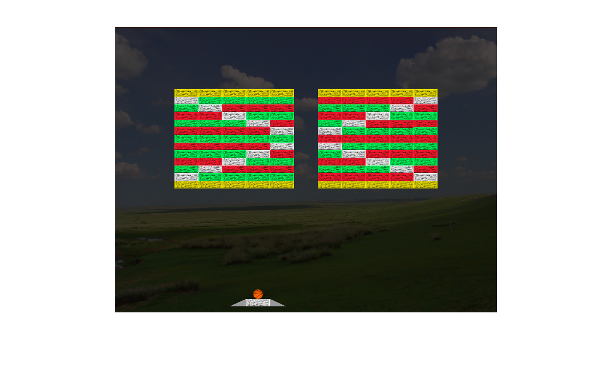

# Unity: Block Breaker!

- This game is an Arkanoid Clone! Here, you have to destroy Bricks with your Ball and prevent Ball from falling down via a Paddle in order to win one level and move forward to another!
- This game has four kind of bricks: Fragile, Weak, Strong and Invincible!
- The Fragile Brick breaks in 1 Hit <b><i>[Yellow Colour]</b></i>!
- The Weak Brick breaks in 2 Hits <b><i>[Green Colour]</b></i>!
- The Strong Brick breaks in 3 Hits <b><i>[Red Colour]</b></i>!
- The Invincible Brick can't be broken and is not intended to be broken too <b><i>[White Colour]</b></i>!
- There are 3 unique Levels! Each Level becomes more and more Complex!
- The First Level is Easy, The second Level is Normal and third Level is Hard Difficulty!
- The Third Level is most challenging, and I doubt anyone would be able to beat it! So, give it a try!

# Screenshots

  
  
  
  
  
  

